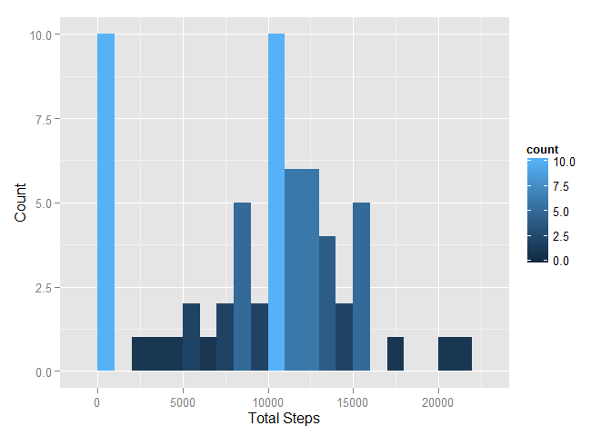
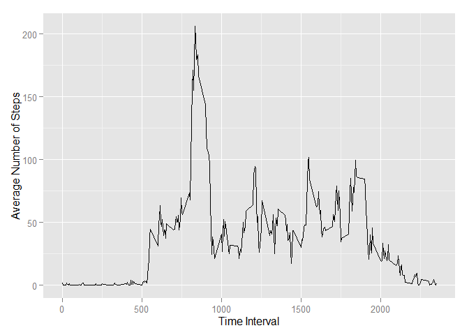
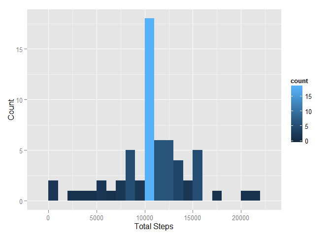
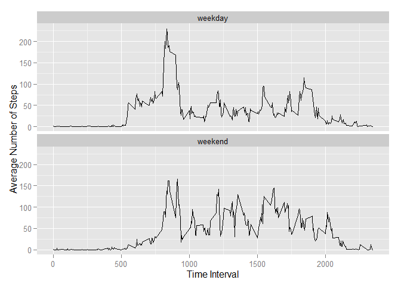

# Reproducible Research: Peer Assessment 1

Barrett W. Nuzum

This analysis uses some popular R libraries to ease processing.

```r
library(plyr)
library(dplyr)
library(ggplot2)
```

## Loading and preprocessing the data

You must first unzip the activity.zip file.


```r
wp <- file("activity/activity.csv") 
theData <- read.csv(wp)
```

## What is mean total number of steps taken per day?    


```r
df2 <- theData %>% group_by(date) %>% summarize(totalSteps = sum(steps,na.rm=TRUE)) 
m <- ggplot(df2, aes(x=totalSteps))
m + geom_histogram(binwidth=1000, aes(fill=..count..)) + labs(x = "Total Steps", y="Count")
```

 

```r
originalMean <- df2 %>% summarize(mean(totalSteps), median(totalSteps)) %>% mutate(dataType = "original")
originalMean
```

```
## Source: local data frame [1 x 3]
## 
##   mean(totalSteps) median(totalSteps) dataType
##              (dbl)              (int)    (chr)
## 1          9354.23              10395 original
```

## What is the average daily activity pattern?

> Make a time series plot (i.e. type = "l") of the 
> 5-minute interval (x-axis) and the average number
> of steps taken, averaged across all days (y-axis)


```r
df3 <- theData %>% group_by(interval) %>% summarize(avgSteps = mean(steps,na.rm=TRUE)) 
z <- ggplot(df3, aes(x=interval, y=avgSteps))
z + geom_line() + labs(x = "Time Interval", y="Average Number of Steps")
```

 

> Which 5-minute interval, on average across all the 
> days in the dataset, contains the maximum number of steps?


```r
df3 %>% slice(which.max(avgSteps))
```

```
## Source: local data frame [1 x 2]
## 
##   interval avgSteps
##      (int)    (dbl)
## 1      835 206.1698
```

## Imputing missing values

> Note that there are a number of days/intervals where there 
> are missing values (coded as NA). The presence of missing
> days may introduce bias into some calculations or summaries of the data.

> Calculate and report the total number of missing values 
> in the dataset (i.e. the total number of rows with NAs)


```r
theData %>% filter(is.na(steps)) %>% nrow()
```

```
## [1] 2304
```

> Devise a strategy for filling in all of the missing values
> in the dataset. The strategy does not need to be sophisticated.

We will calculate the mean steps for each 5 minute interval, removing na values.


```r
intervalAverages <- theData %>% group_by(interval) %>% summarize(avgSteps = mean(steps,na.rm=TRUE)) 
```

> Create a new dataset that is equal to the original dataset
> but with the missing data filled in.


```r
naRows <- theData %>% filter(is.na(steps))
okRows <- theData %>% filter(!is.na(steps))

naRows2 <- merge(naRows, intervalAverages, by="interval")
naRows3 <- transform(naRows2, steps = avgSteps) %>% select(steps, date, interval)

imputedData <- merge(naRows3, okRows, all=TRUE)
```

> Make a histogram of the total number of steps taken each day


```r
df4 <- imputedData %>% group_by(date) %>% summarize(totalSteps = sum(steps,na.rm=TRUE)) 
m <- ggplot(df4, aes(x=totalSteps))
m + geom_histogram(binwidth=1000, aes(fill=..count..)) + labs(x = "Total Steps", y="Count")
```

 

> Calculate and report the mean and median total number of steps taken per day.


```r
imputedMean <- df4 %>% summarize(mean(totalSteps), median(totalSteps)) %>% mutate(dataType = "imputed")
imputedMean
```

```
## Source: local data frame [1 x 3]
## 
##   mean(totalSteps) median(totalSteps) dataType
##              (dbl)              (dbl)    (chr)
## 1         10766.19           10766.19  imputed
```

> Do these values differ from the estimates from the first part of the assignment? 
> What is the impact of imputing missing data on the estimates of the total daily number of steps?


```r
merge(originalMean, imputedMean, all=TRUE)
```

```
##   mean(totalSteps) median(totalSteps) dataType
## 1          9354.23           10395.00 original
## 2         10766.19           10766.19  imputed
```

Massaging the data dramatically skews the mean number of steps, and slightly skews the median.

## Are there differences in activity patterns between weekdays and weekends?

> Create a new factor variable in the dataset with two levels – 
> “weekday” and “weekend” 
> indicating whether a given date is a weekday or weekend day.


```r
weekdayImputed <- imputedData %>% mutate(wday = as.POSIXlt(date)$wday) %>% mutate(weekday = factor(ifelse(wday == 0 | wday == 6,"weekend", "weekday")))
```

> Make a panel plot containing a time series plot (i.e. type = "l")
> of the 5-minute interval (x-axis) and the average number of steps
> taken, averaged across all weekday days or weekend days (y-axis). 


```r
df5 <- weekdayImputed %>% group_by(interval,weekday) %>% summarize(avgSteps = mean(steps,na.rm=TRUE)) 
z <- ggplot(df5, aes(group=weekday, x=interval, y=avgSteps))
z + geom_line() + labs(x = "Time Interval", y="Average Number of Steps") + facet_wrap(~weekday, ncol=1) 
```

 
